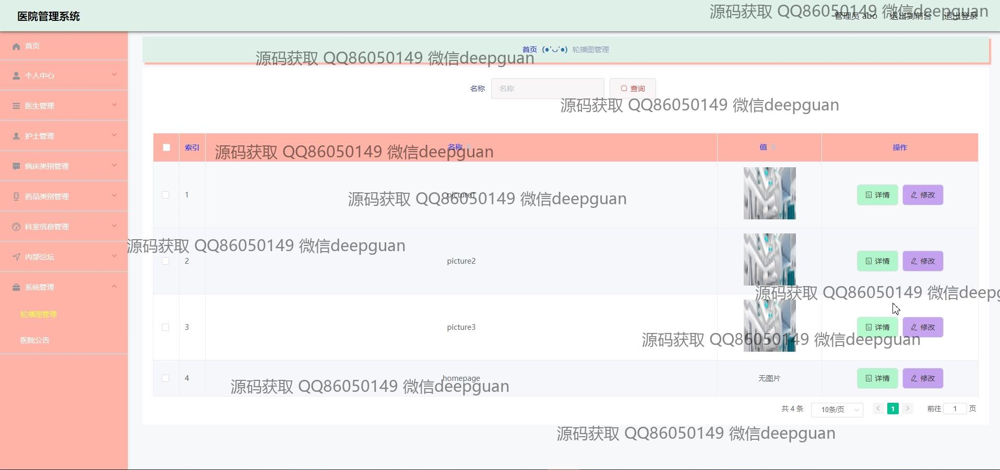
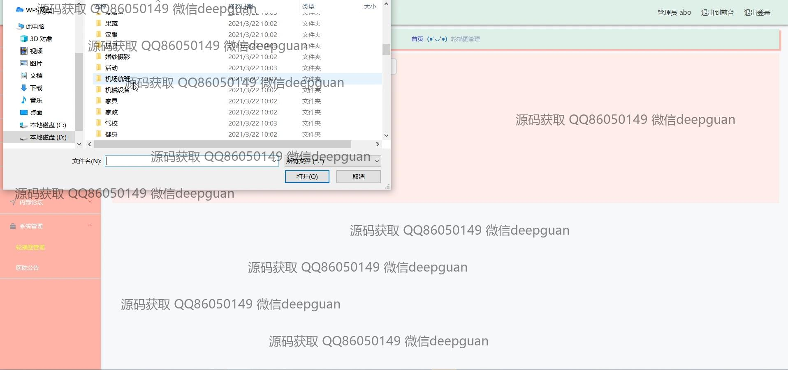

<h1 align="center">医院管理系统</h1>

## 简介
医院管理系统：角色分为管理员和用户；功能包括医生管理、护士管理、病床管理、药品管理、患者信息管理和内部论坛等，全面提升医院运营效率及信息化管理水平。    --计算机毕业设计源码；毕设源码；java毕业设计源码

## 联系方式

<h3 align="center">获取完整代码与数据库文件 + 微信：deepguan QQ: 86050149 QQ群: 783742310</h3>

<h3 align="center">可帮忙远程部署 包运行成功！提供远程部署、修改代码、设计文档指导、代码讲解等服务！</h3>

## 功能介绍（完整见运行截图）
管理员： 基本功能包括登录、注册、退出以及系统管理等。可以管理医院的公告信息、内部论坛、后台管理和科室信息管理。同时负责医生、护士、病床类别、药品类别、病种类别的信息维护。具有添加、修改和删除用户信息的权限。系统还提供详细的统计和报告功能，以帮助提高管理效率和决策支持。

医生： 可以查看和更新个人信息，包括修改密码和上传头像。能够管理病人信息，包括病历记录和药方信息等。医生还可以参与内部论坛，与同事交流专业知识和工作经验。具备编辑和查看科室公告以及参与医院公告发布与维护的权限，以确保信息及时传递。

护士： 负责录入和维护病床管理、病人信息和病房安排。可以查看和修改个人信息，管理其日常工作安排。护士同样能够参与内部论坛，方便与其他医务人员的交流与学习。具备对病床信息、病人住院时间和病床使用状态的管理权限。

药师： 主要负责药房的管理，包括药品信息的录入和更新，以及药品库存和分发管理。能够查看和管理药品类别、药品种类、使用方法、注意事项等详细信息。药师可以通过系统生成药品库存报告，以确保合理管理和使用药品资源。

## 运行截图

本代码来源于网络,仅供学习参考使用!

